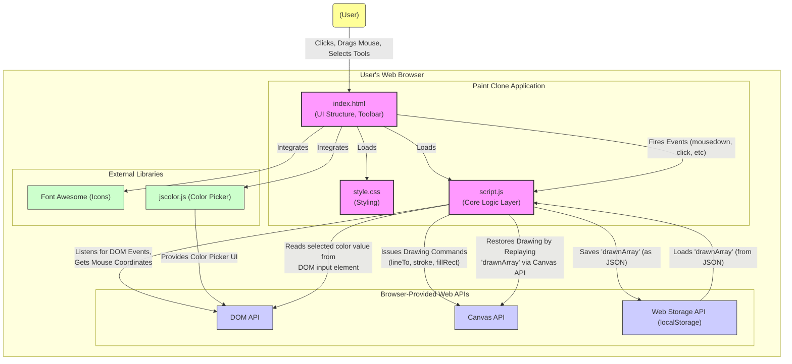

# Awesome Kartikey Paint Clone Architecture

This document provides an overview of the technical architecture, components, and data flow of the Paint Clone application.

## 1. System Architecture Overview

The application follows a simple **client-side architecture**. All logic, rendering, and state management occur within the user's web browser. There is no server-side component involved.

- **Presentation Layer:** HTML (`index.html`) defines the structure of the user interface, including the toolbar and the canvas area. CSS (`style.css`) provides the styling and layout.
- **Logic Layer:** JavaScript (`script.js`) contains the core application logic, handling user interactions, managing the application state, interacting with the Canvas API for drawing, and using the Web Storage API for persistence.
- **External Components:** `jscolor.js` provides the color picker UI, and Font Awesome provides icons.



## 2. Project Folder Structure

The project uses a flat structure, keeping all necessary files in the root directory for simplicity.

```
paint-clone/
├── index.html       # Main HTML file, UI structure
├── jscolor.js       # External color picker library
├── script.js        # Core application JavaScript logic
└── style.css        # CSS styles for the application
```

## 3. Major Components

- **`index.html` (UI Structure & Toolbar)**
  - Defines the main HTML structure.
  - Contains the toolbar elements (buttons, sliders, color inputs) using `div` and Font Awesome `<i>` tags.
  - Includes the CSS and JavaScript files.
  - Provides the initial placeholder where the canvas element will be inserted by JavaScript.
  - Includes a hidden message for mobile users.
- **`style.css` (Styling)**
  - Defines the visual appearance of the toolbar, icons, canvas, sliders, and color pickers.
  - Includes basic responsive design to show a message on small screens.
- **`script.js` (Core Application Logic)**
  - **DOM Manipulation:** Selects and interacts with HTML elements (buttons, sliders, etc.). Dynamically creates and appends the `<canvas>` element.
  - **State Management:** Manages global variables like `currentSize`, `currentColor`, `bucketColor`, `isEraser`, `isMouseDown`, and the `drawnArray` which holds the drawing history.
  - **Event Handling:** Listens for user interactions like mouse clicks (`mousedown`, `mouseup`), mouse movement (`mousemove`), button clicks (`click`), and input changes (`change` for sliders and colors).
  - **Canvas Drawing Engine:** Uses the HTML5 Canvas 2D context (`getContext('2d')`) to perform drawing operations (lines, background fill).
  - **Tool Logic:** Implements the functionality for the brush, eraser, bucket fill, and canvas clearing.
  - **Persistence Logic:** Handles saving the `drawnArray` to `localStorage`, loading it back, and clearing it.
  - **Download Logic:** Uses `canvas.toDataURL()` to generate a data URL for the canvas image and sets it as the `href` for the download link.
- **`jscolor.js` (Color Picker)**
  - An external, self-contained library that attaches interactive color pickers to specified input elements (`.jscolor` class in `index.html`). It handles the UI and color selection logic internally. `script.js` reads the selected color value from the associated input elements.
- **Canvas API (Browser Feature)**
  - The core browser API used for drawing. `script.js` interacts heavily with the `CanvasRenderingContext2D` object obtained from the `<canvas>` element. Methods like `beginPath()`, `moveTo()`, `lineTo()`, `stroke()`, `fillRect()`, `fillStyle`, `strokeStyle`, `lineWidth`, etc., are used.

## 4. Data Flow

**Drawing Flow:**

1.  **User Action:** User presses the mouse button down on the canvas (`mousedown`).
2.  **Event Listener (`script.js`):** The `mousedown` listener activates.
    - Sets `isMouseDown = true`.
    - Gets mouse coordinates using `getMousePosition()`.
    - Configures the canvas context (`lineWidth`, `lineCap`, `strokeStyle` based on current tool/color/size).
    - Calls `context.beginPath()` and `context.moveTo()` to start a new path.
3.  **User Action:** User moves the mouse while holding the button down (`mousemove`).
4.  **Event Listener (`script.js`):** The `mousemove` listener fires _only if_ `isMouseDown` is true.
    - Gets current mouse coordinates.
    - Calls `context.lineTo()` to extend the path.
    - Calls `context.stroke()` to draw the line segment on the canvas.
    - Calls `storeDrawn()` to push the current point coordinates, size, color, and eraser status into the `drawnArray`.
5.  **User Action:** User releases the mouse button (`mouseup`).
6.  **Event Listener (`script.js`):** The `mouseup` listener activates.
    - Sets `isMouseDown = false`.

**Load from Local Storage Flow:**

1.  **User Action:** User clicks the "Load Storage" button (`click`).
2.  **Event Listener (`script.js`):** The `loadStorageBtn` listener fires.
3.  **Retrieve Data:** Attempts to get the 'savedCanvas' item from `localStorage`.
4.  **Parse Data:** If data exists, `JSON.parse()` converts the stored string back into the `drawnArray`.
5.  **Restore Canvas:** The `restoreCanvas()` function is called.
    - It iterates through the `drawnArray`.
    - For each point (starting from the second), it configures the context (`lineWidth`, `strokeStyle` - using `bucketColor` if `erase` is true) based on the stored properties in `drawnArray`.
    - It uses `moveTo()` and `lineTo()` between consecutive points in the array and calls `stroke()` to redraw the saved lines onto the canvas.
6.  **UI Update:** Displays a "Canvas Loaded" message briefly.

**Save to Local Storage Flow:**

1.  **User Action:** User clicks the "Save Storage" button (`click`).
2.  **Event Listener (`script.js`):** The `saveStorageBtn` listener fires.
3.  **Serialize Data:** `JSON.stringify()` converts the current `drawnArray` into a JSON string.
4.  **Store Data:** `localStorage.setItem('savedCanvas', ...)` saves the string in local storage.
5.  **UI Update:** Displays a "Canvas Saved" message briefly.

## 5. Design Decisions

- **Vanilla JavaScript:** Chosen for simplicity and to avoid the overhead of frameworks for this relatively small project. It also demonstrates core JavaScript and DOM manipulation skills.
- **Client-Side Only:** Keeps the architecture simple, requires no backend setup, and makes deployment easy (just hosting static files).
- **`drawnArray` for State/Restore:** Using an array (`drawnArray`) to store every drawn point (or segment) provides a straightforward way to implement save/load functionality by replaying the drawing actions.
  - _Trade-off:_ This can become inefficient for very complex drawings, as the array grows large, and redrawing involves iterating through the entire history.
- **Canvas API:** The standard and most suitable browser API for bitmap drawing applications.
- **jscolor.js:** Leveraging an existing library for the color picker saves development time compared to building a custom one.
- **Simple Eraser Implementation:** Implementing the eraser by drawing with the background color is simpler than manipulating pixel data directly.
  - _Trade-off:_ If the background is complex (e.g., an image), this method wouldn't work correctly.
- **Basic Responsive Handling:** Instead of a complex responsive UI, a simple message is shown on small screens, acknowledging the limitation.
- **Synchronous Local Storage:** Using `localStorage` is simple for basic persistence but is synchronous and has size limits (usually 5-10MB).
